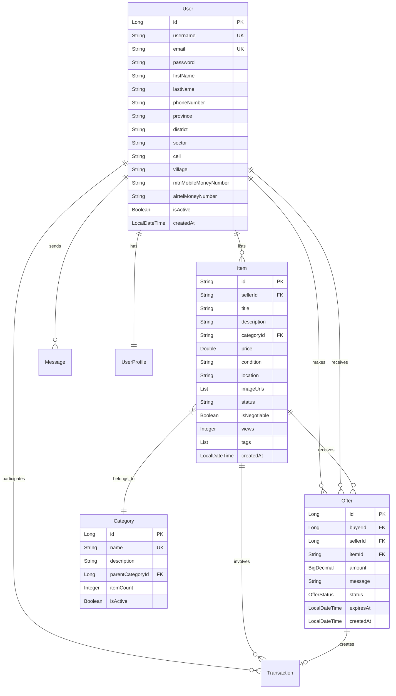

# House Treasures - Peer-to-Peer Marketplace

A modern web application connecting buyers and sellers of household items in Rwanda, featuring mobile money integration and location-based discovery.

## Table of Contents
- [Problem Statement & Business Requirements](#problem-statement--business-requirements)
- [Domain & Data Modeling](#domain--data-modeling)
- [Frontend Design & Responsiveness](#frontend-design--responsiveness)
- [Backend Architecture](#backend-architecture)
- [Database Implementation](#database-implementation)
- [Security Implementation](#security-implementation)
- [Authorization Model](#authorization-model)
- [Getting Started](#getting-started)
- [Performance Optimizations](#performance-optimizations)
- [Deployment](#deployment)

## Problem Statement & Business Requirements

### Problem Description
House Treasures addresses the challenge of monetizing unused household items in Rwanda by providing a peer-to-peer marketplace that connects sellers directly with buyers. The platform eliminates intermediaries while facilitating secure transactions through integrated mobile money payment systems (MTN Mobile Money and Airtel Money).

### Key Business Requirements
- **Direct P2P Trading**: Enable direct communication between buyers and sellers
- **Mobile Money Integration**: Support for MTN Mobile Money and Airtel Money payments
- **Location-Based Discovery**: Items searchable by Rwanda's administrative divisions (Province → District → Sector → Cell → Village)
- **Offer Management**: Comprehensive offer/counter-offer negotiation system
- **Real-time Messaging**: In-app communication between users
- **Category Management**: Hierarchical product categorization
- **Transaction Tracking**: Complete transaction lifecycle management

### Quality Attributes
- **Security**: Secure authentication and data protection
- **Scalability**: Support for growing user base across Rwanda
- **Usability**: Responsive design for mobile and desktop users
- **Reliability**: 99% uptime with robust error handling
- **Performance**: Fast search and filtering capabilities
- **Maintainability**: Clean, modular architecture

## Domain & Data Modeling

### Entity Relationship Overview



### Principal Domain Concepts

**Core Actors:**
- **Users**: Individuals who can act as both buyers and sellers
- **Administrators**: System managers with elevated privileges

**Key Processes:**
- **Item Listing**: Users create item listings with descriptions, images, and pricing
- **Discovery & Search**: Users find items through categories, location, and keywords
- **Negotiation**: Offer/counter-offer system for price negotiation
- **Transaction Processing**: Secure payment and delivery coordination
- **Communication**: Real-time messaging between users

## Frontend Design & Responsiveness

### Technology Stack
- **Framework**: React 18 with TypeScript
- **Build Tool**: Vite for fast development and optimized builds
- **Styling**: Custom CSS with responsive breakpoints
- **UI Components**: React Bootstrap for responsive design
- **Icons**: React Icons (FontAwesome)

### Key Features
- **Mobile-First Design**: Optimized for mobile devices with responsive breakpoints
- **Component Architecture**: Modular, reusable components
- **Real-time Updates**: Live messaging and notification system
- **Progressive Web App**: Offline capabilities and app-like experience

### Folder Structure
```
src/
├── components/
│   ├── common/          # Reusable UI components
│   │   ├── AlertMessage.jsx
│   │   ├── CategoryCard.jsx
│   │   ├── CustomButton.jsx
│   │   ├── CustomModal.jsx
│   │   ├── ItemCard.jsx
│   │   ├── LoadingSpinner.jsx
│   │   └── SearchBox.jsx
│   └── layout/          # Layout components
│       ├── DashboardLayout.jsx
│       ├── DashboardSidebar.jsx
│       ├── Footer.jsx
│       └── Navbar.jsx
├── contexts/
│   └── AuthContext.jsx  # Authentication state management
├── pages/
│   ├── auth/            # Authentication pages
│   ├── items/           # Item management pages
│   ├── Dashboard.jsx
│   ├── Home.jsx
│   ├── Messages.jsx
│   ├── Offers.jsx
│   ├── Profile.jsx
│   └── Transactions.jsx
└── services/
    └── api.js           # API communication layer
```

## Backend Architecture

### Architecture Style: Layered Monolithic with Domain Separation

**Technology Stack:**
- **Framework**: Spring Boot 3.x
- **Language**: Java 17+
- **Build Tool**: Maven
- **Databases**: PostgreSQL + MongoDB 

**Layer Structure:**
```
src/main/java/com/housetreasure/
├── controller/          # REST API endpoints
│   ├── AuthController.java
│   ├── ItemController.java
│   ├── OfferController.java
│   ├── MessageController.java
│   └── UserController.java
├── service/             # Business logic layer
│   ├── UserService.java
│   ├── ItemService.java
│   ├── OfferService.java
│   └── MessageService.java
├── repository/          # Data access layer
│   ├── UserRepository.java
│   ├── ItemRepository.java
│   └── OfferRepository.java
├── model/               # Domain entities
│   ├── User.java
│   ├── Item.java
│   ├── Offer.java
│   └── Transaction.java
└── config/              # Configuration classes
    ├── SecurityConfig.java
    ├── CorsConfig.java
    └── PasswordEncoderConfig.java
```

## Database Implementation

### Polyglot Persistence Strategy

**PostgreSQL (ACID Transactions):**
- User accounts and authentication data
- Financial transactions and offers
- Categories and relationships
- Messaging system

**MongoDB (Flexible Schema):**
- Item listings with variable attributes
- Search indexing and full-text search
- Media metadata and tags

### Key Database Features
- **Indexing**: Optimized queries for search and filtering
- **Constraints**: Data integrity through foreign keys and validation
- **Relationships**: Proper entity relationships with cascade operations
- **Scalability**: Prepared for horizontal scaling with sharding

## Security Implementation

### Authentication & Authorization
- **Password Encoding**: BCrypt hashing for secure password storage
- **Token-Based Authentication**: JWT tokens for stateless authentication
- **CORS Configuration**: Secure cross-origin resource sharing
- **Role-Based Access Control**: User and admin role separation

### Security Features
- **Input Validation**: Server-side validation for all user inputs
- **SQL Injection Prevention**: Parameterized queries and ORM usage
- **XSS Protection**: Output encoding and CSP headers
- **Rate Limiting**: API endpoint protection against abuse

## Getting Started

### Prerequisites
- REact
- Java 17
- PostgreSQL 
- MongoDB 
- Git

### Installation

#### Frontend Setup
```bash
# Clone the repository
git clone <repository-url>
cd house_treasure_frontend

# Install dependencies
npm install

# Start development server
npm run dev
```

#### Backend Setup
```bash
# Navigate to backend directory
cd house_treasure_backend

# Install dependencies and build
mvn clean install

# Run the application
mvn spring-boot:run
```

### Environment Configuration

#### Frontend (.env)
```env
VITE_API_BASE_URL=http://localhost:8080/api
VITE_APP_NAME=House Treasures
```

#### Backend (application.properties)
```properties
# Database Configuration
spring.datasource.url=jdbc:postgresql://localhost:5432/housetreasures
spring.datasource.username=${DB_USERNAME:housetreasures}
spring.datasource.password=${DB_PASSWORD:password}

# MongoDB Configuration
spring.data.mongodb.uri=mongodb://localhost:27017/housetreasures

# Server Configuration
server.port=8080
```

### Running the Application

1. **Start PostgreSQL and MongoDB services**
2. **Run the backend server:**
   ```bash
   cd house_treasure_backend
   mvn spring-boot:run
   ```
3. **Start the frontend development server:**
   ```bash
   cd house_treasure_frontend
   npm run dev
   ```
4. **Access the application at `http://localhost:5173`**

### Building for Production

#### Frontend
```bash
npm run build
```

#### Backend
```bash
mvn clean package
java -jar target/backend-0.0.1-SNAPSHOT.jar
```

## Performance Optimizations

### Frontend Optimizations
- **Code Splitting**: Automatic route-based code splitting with Vite
- **Lazy Loading**: Component-based loading for better performance
- **Caching**: Browser caching for static assets

### Backend Optimizations
- **Database Indexing**: Optimized queries with proper indexing
- **Connection Pooling**: Efficient database connection management
- **Pagination**: Large result set handling

## Deployment
### Production Deployment
- **Frontend**: Deployed on Netlify
- **Backend**: Deploy on Render
- **Database**: Managed database services (AWS RDS, MongoDB Atlas)
- **CDN**: Static asset delivery optimization


## API Documentation

### Authentication Endpoints
- `POST /api/auth/register` - User registration
- `POST /api/auth/login` - User login
- `POST /api/auth/logout` - User logout

### Item Management
- `GET /api/items` - List items with pagination and filtering
- `POST /api/items` - Create new item listing
- `GET /api/items/{id}` - Get item details
- `PUT /api/items/{id}` - Update item
- `DELETE /api/items/{id}` - Delete item

### Offer Management
- `GET /api/offers` - List user offers
- `POST /api/offers` - Create new offer
- `PUT /api/offers/{id}` - Update offer status
- `DELETE /api/offers/{id}` - Cancel offer


## License

This project is licensed under the MIT License - see the [LICENSE](LICENSE) file for details.

**House Treasures** - Connecting Rwanda through trusted peer-to-peer commerce.